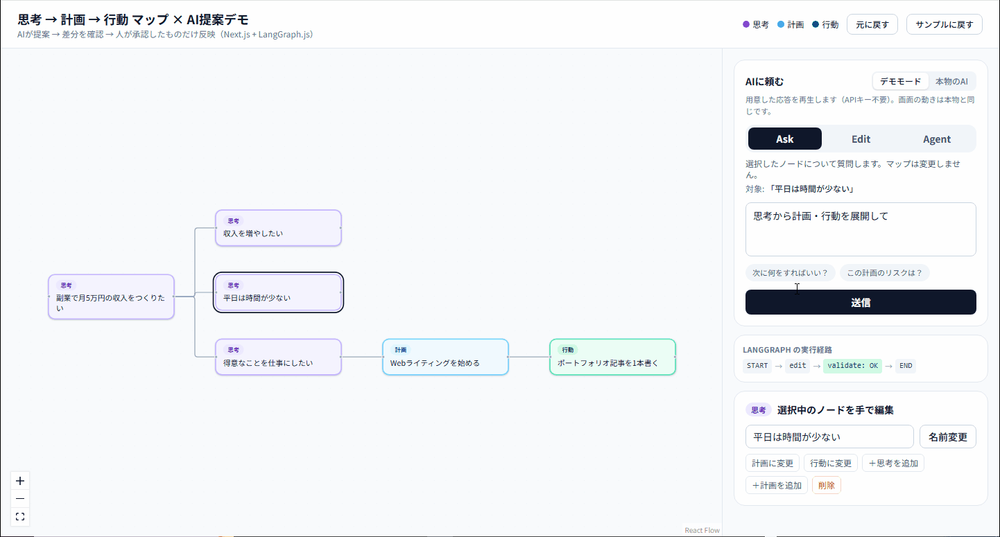
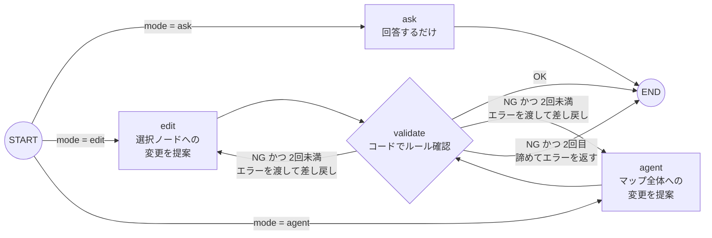

# 思考 → 計画 → 行動 マップ × AI提案デモ（Human-in-the-loop）

[English](./README.md) | **日本語**

マインドマップの変更を **AIが提案** し、ユーザーが **差分を確認** して、**承認したものだけ** を反映する小さな動くデモです。Next.js 16 + LangGraph.js で作り、LLM は Claude を既定にしています（OpenAI に切り替え可能）。



> 🔗 デモURL: https://myond-map-demo.vercel.app — **デモモード** ならAPIキーなしで操作できます。本物のAIを使うには合言葉が必要です（応募文に記載）。

---

## できること

| | |
|---|---|
| **3種類のノード** | 💜 思考 / 💙 計画 / 💚 行動。左から右へ「思考 → 計画 → 行動」と流れる木構造。行動の下に思考を置くなどの逆流はプログラムで禁止しています。 |
| **Ask** | 選択したノードについてAIに質問する。**マップは一切変更しない。** |
| **Edit** | 選択したノードの名前変更と、その直下への子ノード追加だけをAIが提案する。 |
| **Agent** | マップ全体を見て、複数の変更をまとめて提案する（例：「思考から計画・行動を展開して」「重複を整理して」）。 |
| **差分プレビュー** | 提案をマップに重ねて表示：追加=緑の点線、変更=黄（旧ラベルに取り消し線）、削除=赤。変更ごとに理由とチェックボックス付き。 |
| **承認 / 却下 / 元に戻す** | チェックした変更だけを反映。1段階のアンドゥ付き。 |
| **実行経路の表示** | どのLangGraphノードを通ったかを表示（例：`START → agent → validate: NG → agent → validate: OK → END`）。 |

## 設計意図

### なぜAIの提案をすぐ反映せず、差分承認にしたか

- **マップはユーザー自身の思考そのもの。** 勝手に書き換えられると信頼が損なわれます。AIは「提案する伴走者」、決めるのは人です。
- **LLMは自信満々に間違えることがある。** 差分で見せれば反映前に誤りに気づけ、変更ごとのチェックで「良い部分だけ採用」ができます（全部か無しかにしない）。
- **一番危ないのは削除。** 削除予定のノードと配下は、承認されるまで赤で残して必ず目に入るようにしています。

### なぜLLMにマップを直接書かせず、構造化出力（JSON）にしたか

- LLMは **操作のリスト**（`add` / `update` / `delete` と `reason`）を返し、**Zodスキーマ** で形を保証。反映はプログラムが行います。
- こうすると、ユーザーに見せる前に **全操作をコードでチェック** できます（IDの存在、階層ルール、Editモードの範囲、上限）。NGなら具体的なエラー文を付けてLLMに作り直させます（下図）。
- 座標（x/y）はプログラム（dagre）が自動計算。AIは「何を・どこの下に」という意味だけを決めればよく、失敗が減ります。
- スキーマはあえてフラット（全項目必須・不要なら `null`）にし、**Anthropic と OpenAI どちらの厳格な構造化出力でも同じスキーマで動く** ようにしています。
- 画面での手動編集も **同じ `applyProposal` を通る** ので、人が編集してもAIが編集しても同じルールで守られます。

## LangGraph のグラフ構成



- **State（共有メモ）**: `mode, map, selectedId, instruction, answer, proposal, validationErrors, attempts, trace`
- **差し戻しループ**: 1リクエストあたり生成は最大2回。コストの上限を固定するため。
- **承認（Human-in-the-loop）はグラフの外、ブラウザ側で行う。** LangGraph の `interrupt()` で止めるには途中状態を保存するDB（チェックポインタ）が必要ですが、Vercel のサーバーレス環境ではメモリ上の状態が承認時に消えている可能性があります。そこでグラフは「検証済みの提案を返す」ところで終わり、承認と反映はブラウザ側の純関数で行う構成にしました。サーバーは状態を持ちません。

非エンジニア向けの解説は [docs/LEARNING.md](./docs/LEARNING.md) にまとめています。

## 技術スタック

- **Next.js 16**（App Router、`proxy.ts`）、TypeScript、Tailwind CSS v4
- **LangGraph.js**（`StateGraph`、`StateSchema`、条件付きエッジ、trace用のreducer）
- **@langchain/anthropic**（既定）/ **@langchain/openai**（切替可）
- **Zod**（構造化出力・リクエスト検証）
- **React Flow**（`@xyflow/react`）+ **dagre**（自動レイアウト）
- **Vitest**（マップのロジックと、偽モデルを使ったグラフのテスト）

## LLMの切り替え（Claude ⇄ OpenAI）

グラフが依存しているのは `withStructuredOutput` という最小限のインターフェースだけなので、**設定だけで切り替え** られます。

```bash
LLM_PROVIDER=openai          # 既定は anthropic
OPENAI_API_KEY=sk-...
OPENAI_MODEL=gpt-5.6-terra   # 構造化出力に対応したモデルなら可
```

実装は `src/lib/agent/model.ts`。グラフ・プロンプト・スキーマの変更は不要です。

## 起動手順

```bash
npm install
cp .env.example .env.local   # 値を入れる（APIキーは無くても可）
npm run dev                  # http://localhost:3000
npm test                     # ユニットテスト
```

APIキーが無い場合は **デモモード**（用意した応答を再生。差分・承認は本物と同じコードを通る）で動きます。

### 環境変数

| 名前 | 用途 |
|---|---|
| `LLM_PROVIDER` | `anthropic`（既定）または `openai` |
| `ANTHROPIC_API_KEY` / `ANTHROPIC_MODEL` | Claude の設定（既定モデル `claude-sonnet-5`） |
| `OPENAI_API_KEY` / `OPENAI_MODEL` | OpenAI の設定 |
| `DEMO_PASSCODE` | 本物のAIを使うための合言葉 |
| `SESSION_SECRET` | セッションCookie署名用の16文字以上のランダム文字列 |
| `MAX_CALLS_PER_SESSION` | 1セッションのAI呼び出し上限（既定20） |

### Vercel へのデプロイ

1. GitHub に push し、Vercel でリポジトリをインポート
2. **Project → Settings → Environment Variables** に上の環境変数を設定
3. Anthropic / OpenAI のコンソールで **月額の利用上限** も設定しておく

## セキュリティ・コスト対策

- APIキーは **サーバー側でのみ** 読む（`import "server-only"`、`NEXT_PUBLIC_` を使わない）。ブラウザがLLMを直接呼ぶことはない。
- `/api/agent` は `proxy.ts` と Route Handler の **二重** でチェック。
- 合言葉 → HMAC署名付き・`httpOnly`・`SameSite=Strict` のCookieを発行。
- セッションごとの呼び出し上限（超過で429）。カウントは **LLMを呼ぶ前に** 進めるので、エラーになるリクエストでも回数を消費する。
- 入力上限：指示500文字、ノード60件、操作12件、`maxTokens` 8000（Claudeの思考トークン込み）、`effort: "medium"`。
- デモモードは合言葉もAPIキーも不要。

## 制限事項

- **呼び出し回数のカウンタは署名付きCookieに保存しています。** 改ざんはできませんが、**Cookieを削除して合言葉を入れ直すと回数はリセットされます**。本番では Redis（Upstash など）でユーザーやIP単位にサーバー側で数えるべきです。
- 同じCookieで同時にリクエストすると、両方が上限チェックを通過することがあります（サーバー側のロックが無いため）。
- マップはブラウザの `localStorage` にのみ保存（アカウント・同期なし）。
- 元に戻すは1段階のみ。
- 合言葉の総当たり対策は小さな遅延のみ。本番ではIP単位のレート制限が必要です。

## 今後の拡張案（Myondに組み込む場合の想定）

- **`interrupt()` + 永続チェックポインタ（Postgres）によるサーバー側HITL**：承認待ちの提案を端末をまたいで保持し、後から監査もできるようにする。
- **ストリーミング**（`graph.stream`）で、AIが考えている過程と実行経路をリアルタイムに表示。
- **ツール呼び出し**：過去のマップ、カレンダー、タスク履歴を参照してから行動を提案する。
- **承認履歴からの学習**：どの提案が採用／却下されたかを蓄積し、ユーザーの好みとしてプロンプトに反映。
- **ユーザー単位のレート制限と利用状況ダッシュボード**（Redis）。
- **評価セット**：代表的なマップと期待する提案を用意し、プロンプトやモデル変更時の回帰テストに使う。

## デモGIFの撮り方

[ScreenToGif](https://www.screentogif.com/)（Windows）などで、デモモード → **Ask** → **Edit**（ノードを選択）→ **Agent** → 変更を1つチェックから外す → **承認** → **元に戻す** の順に録画し、`docs/demo.gif` として保存します。

## ディレクトリ構成

```
src/
  app/                 画面 + APIルート（agent / login / status）
  proxy.ts             /api/agent の門番（Next.js 16 で middleware から改名）
  lib/map/             型、Zodスキーマ、applyProposal、validateProposal、差分、レイアウト
  lib/agent/           LangGraph のグラフ、プロンプト、モデル切替（Claude/OpenAI）
  lib/demo/            デモモードの固定応答
  lib/session.ts       署名付きCookieのセッションと回数カウンタ
  components/          マップ（React Flow）、AIパネル、差分パネル、ノード編集
tests/                 Vitest
docs/LEARNING.md       グラフの仕組みのやさしい解説
```
