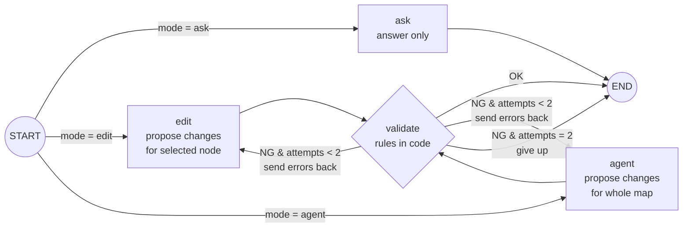

# Thought → Plan → Action Map × AI Proposals (Human-in-the-loop demo)

**English** | [日本語](./README.ja.md)

A small working demo where an AI **proposes** edits to a mind map, the user **reviews the diff**, and only the **approved** changes are applied. Built with Next.js 16 + LangGraph.js, using Claude by default (switchable to OpenAI).


> 🔗 Live demo: https://myond-map-demo.vercel.app — works without an API key in **Demo mode**. The real AI mode needs a passcode (shared in my application).

---

## What it does

| | |
|---|---|
| **3 node types** | 💜 Thought / 💙 Plan / 💚 Action. The tree flows left → right: *Thought → Plan → Action*. The rule is enforced in code (e.g. no Thought under an Action). |
| **Ask** | Ask the AI about the selected node. **Never modifies the map.** |
| **Edit** | AI proposes a rename of the selected node and new children under it — nothing else. |
| **Agent** | AI looks at the whole map and proposes several changes at once (e.g. "expand thoughts into plans and actions", "remove duplicates"). |
| **Diff preview** | Proposals are overlaid on the map: added = green dashed, changed = amber (old label struck through), deleted = red. Each change has a checkbox and a reason. |
| **Approve / Reject / Undo** | Only checked changes are applied. One-step undo. |
| **Execution trace** | Shows which LangGraph nodes ran, e.g. `START → agent → validate: NG → agent → validate: OK → END`. |

## Design decisions

### Why AI proposals are not applied immediately (diff + approval)

- **The map is the user's own thinking.** Silently rewriting someone's thoughts erodes trust. The AI is a collaborator that *suggests*; the human decides.
- **LLMs are sometimes confidently wrong.** A diff makes mistakes visible *before* they land, and per-change checkboxes let the user keep the good parts instead of all-or-nothing.
- **Deletions are the dangerous part**, so deleted nodes (and their descendants) stay visible in red until approval.

### Why structured output (JSON) instead of letting the LLM write the map

- The LLM returns a list of **operations** (`add` / `update` / `delete` with a `reason`), validated by a **Zod schema**. The program applies them.
- This lets the code **check every operation before it reaches the user** (IDs exist, hierarchy rules, Edit-mode scope, limits). Invalid proposals are sent back to the LLM with the exact error messages (see the graph below).
- Layout (x/y positions) is computed by the program (dagre), so the AI only decides *meaning*, not pixels.
- The schema is intentionally flat (every field required, unused ones `null`) so it works with **both Anthropic and OpenAI** strict structured-output modes.
- Manual edits in the UI go through the **same** `applyProposal` function, so humans and AI obey the same rules.

## LangGraph structure



- **State**: `mode, map, selectedId, instruction, answer, proposal, validationErrors, attempts, trace`
- **Retry loop**: at most 2 generations per request, to cap cost.
- **Human-in-the-loop lives in the browser, not in the graph.** LangGraph's `interrupt()` needs a persistent checkpointer; on Vercel serverless, in-memory state may be gone by the time the user clicks "Approve". So the graph ends at "validated proposal", and approval/application happens client-side with a pure function. The server stays stateless.

A non-engineer-friendly walkthrough is in [docs/LEARNING.md](./docs/LEARNING.md) (Japanese).

## Tech stack

- **Next.js 16** (App Router, `proxy.ts`), TypeScript, Tailwind CSS v4
- **LangGraph.js** (`StateGraph`, `StateSchema`, conditional edges, reducer for trace)
- **@langchain/anthropic** (default) / **@langchain/openai** (switchable)
- **Zod** (structured output + request validation)
- **React Flow** (`@xyflow/react`) + **dagre** (auto layout)
- **Vitest** (unit tests for map logic & graph with a fake model)

## Switching the LLM (Claude ⇄ OpenAI)

The graph only depends on a tiny interface (`withStructuredOutput`), so switching is **config only**:

```bash
LLM_PROVIDER=openai          # or anthropic (default)
OPENAI_API_KEY=sk-...
OPENAI_MODEL=gpt-5.6-terra   # any model that supports structured output
```

See `src/lib/agent/model.ts`. No changes to the graph, prompts, or schema are needed.

## Getting started

```bash
npm install
cp .env.example .env.local   # fill in values (API key optional)
npm run dev                  # http://localhost:3000
npm test                     # unit tests
```

Without an API key the app runs in **Demo mode** (pre-recorded responses through the exact same diff/approve code path).

### Environment variables

| Name | Purpose |
|---|---|
| `LLM_PROVIDER` | `anthropic` (default) or `openai` |
| `ANTHROPIC_API_KEY` / `ANTHROPIC_MODEL` | Claude settings (default model `claude-sonnet-5`) |
| `OPENAI_API_KEY` / `OPENAI_MODEL` | OpenAI settings |
| `DEMO_PASSCODE` | Passcode required to use the real AI |
| `SESSION_SECRET` | 16+ random chars for signing the session cookie |
| `MAX_CALLS_PER_SESSION` | AI calls allowed per session (default 20) |

### Deploy to Vercel

1. Push to GitHub and import the repo on Vercel.
2. Set the environment variables above in **Project → Settings → Environment Variables**.
3. Also set a **monthly spend limit** in the Anthropic / OpenAI console.

## Security & cost controls

- API keys are read **only on the server** (`import "server-only"`, no `NEXT_PUBLIC_`). The browser never calls the LLM directly.
- `/api/agent` is guarded twice: in `proxy.ts` and again in the route handler.
- Passcode → HMAC-signed, `httpOnly`, `SameSite=Strict` cookie.
- Per-session call limit (429 when exceeded); the counter is incremented **before** calling the LLM, so failing requests still count.
- Input limits: instruction ≤ 500 chars, ≤ 60 nodes, ≤ 12 operations, `maxTokens` = 2000.
- Demo mode needs no passcode and no key.

## Limitations

- **The call counter lives in a signed cookie.** It cannot be forged, but **deleting the cookie and re-entering the passcode resets it**. In production, count on the server side (e.g. Redis / Upstash keyed by user or IP).
- Concurrent requests with the same cookie may both pass the limit check (no server-side lock).
- The map is saved only in the browser's `localStorage` (no accounts, no sync).
- Undo is one step.
- Login brute-force protection is just a small delay; production would need IP-based rate limiting.

## Future ideas (if built into Myond)

- **Server-side HITL with `interrupt()`** + a persistent checkpointer (Postgres), so a proposal can wait for approval across devices and be audited later.
- **Streaming** the proposal and trace (`graph.stream`) so users see the AI "thinking" step by step.
- **Tools** in the graph: look up past maps, calendar, or task history before proposing actions.
- **Learning from approvals**: store which proposals users accept/reject and feed that back as preferences.
- **Per-user rate limits & usage dashboard** with Redis.
- **Evaluation**: a small set of maps + expected proposals to regression-test prompts and model changes.

## Recording the demo GIF

Use [ScreenToGif](https://www.screentogif.com/) (Windows) or similar: Demo mode → **Ask** → **Edit** (select a node) → **Agent** → uncheck one change → **Approve** → **Undo**. Save as `docs/demo.gif`.

## Project structure

```
src/
  app/                 page + API routes (agent / login / status)
  proxy.ts             guards /api/agent (Next.js 16 replacement for middleware)
  lib/map/             types, Zod schemas, applyProposal, validateProposal, diff, layout
  lib/agent/           LangGraph graph, prompts, model factory (Claude/OpenAI)
  lib/demo/            demo-mode fixtures
  lib/session.ts       signed cookie session + call counter
  components/          map (React Flow), AI panel, diff panel, node editor
tests/                 Vitest
docs/LEARNING.md       plain-language explanation of the graph (JA)
```
