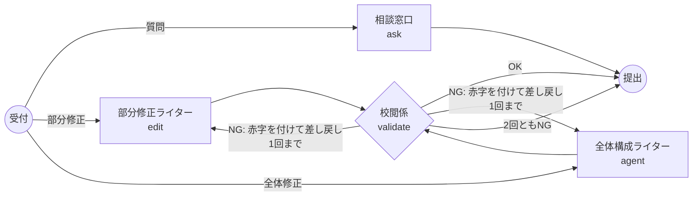

# LangGraph の仕組みを、やさしい言葉で

面談で「このデモの中で何が起きているのか」を説明するためのメモです。専門用語はなるべく使わず、たとえ話で書いています。

---

## 1. ひとことで言うと

> **AIに「マップの変更案」を作らせ、プログラムがチェックし、ダメなら作り直させ、最後は人が承認する。**

この「作る → チェック → 作り直し」の流れを、LangGraph という道具で **フローチャートのように** 組み立てています。

---

## 2. たとえ話：編集部の原稿チェック

このグラフは、小さな編集部にたとえると分かりやすいです。

| グラフの部品 | 編集部でいうと | 何をしているか |
|---|---|---|
| **State（共有メモ）** | 机の上の **案件ファイル** | 依頼内容・今のマップ・作った案・チェック結果・何回作り直したか、を全部はさんでおくファイル。全員がこれを見て、書き足して、次の人に回す。 |
| **START → 分岐** | **受付係** | 依頼の種類（Ask / Edit / Agent）を見て、担当者に振り分ける。 |
| **ask ノード** | **相談窓口の人** | 質問に答えるだけ。原稿（マップ）には一切手を付けない。 |
| **edit ノード** | **部分修正の担当ライター** | 選ばれた1か所だけを直す案を書く。「名前を変える」「すぐ下に項目を足す」だけが許されている。 |
| **agent ノード** | **全体構成の担当ライター** | マップ全体を見て、まとめて何か所も直す案を書く。 |
| **validate ノード** | **校閲係（チェック担当）** | ライターの案を、決まったルールで機械的にチェックする。AIではなくプログラムなので、気分で見逃したりしない。 |
| **validate からの矢印** | **校閲係の判断** | OKなら完成。NGなら「ここがダメ」と赤字を入れてライターに差し戻す。ただし差し戻しは1回まで。 |
| **END** | **完成品の提出** | 完成した案（またはエラー）を画面に返す。 |
| **承認ボタン** | **編集長（=ユーザー）の決裁** | 最終的に載せるかどうかは人が決める。これはグラフの外、画面側で行う。 |

---

## 3. 図で見る流れ

- **ノード（四角や丸）** ＝ 仕事をする人
- **エッジ（矢印）** ＝ 次に誰へ回すか
- **条件付きエッジ（ラベル付きの矢印）** ＝ 状況によって回し先が変わる矢印（受付係の振り分け、校閲係の判断）

---

## 4. データの流れ（Agentモードで「思考から計画・行動を展開して」と頼んだ場合）

1. **画面 → サーバー**
   画面が「モード: agent」「今のマップ」「選択中のノード」「指示文」をサーバーに送る。
   サーバーはまず **合言葉を通過した人か** と **回数の上限を超えていないか** を確認する。

2. **受付（START）**
   案件ファイル（State）に依頼内容を入れ、モードが agent なので **agent ノード** へ回す。

3. **agent ノード（AIが案を書く）**
   マップを読みやすいテキストにしてAI（Claude）に渡し、
   「追加・変更・削除のリストを、決まった形（JSON）で返して」と頼む。
   返ってきた案を案件ファイルに書き込み、「作成回数 = 1」にする。

4. **validate ノード（プログラムがチェック）**
   たとえば AI が「行動ノードの下に思考ノードを追加」という案を出していたら、
   ルール違反なので **「行動ノードの下に思考ノードは置けません」** という赤字を案件ファイルに書く。

5. **差し戻し**
   赤字があり、まだ1回しか作っていないので、**agent ノードへ戻す**。
   今度は「前回の案」と「赤字の内容」も一緒にAIに見せるので、AIは同じ間違いをしにくい。

6. **再チェック → 完成（END）**
   2回目の案がルールを満たしていれば完成。画面に返す。
   （2回ともダメなら、あきらめてエラーとして返す。何度も作り直すとAPI料金が増えるため）

7. **画面での差分表示と承認（グラフの外）**
   画面は案をマップに重ねて表示する（追加=緑、変更=黄、削除=赤）。
   ユーザーが項目ごとにチェックを付け外しして「承認」を押すと、
   **チェックされた変更だけ** がマップに反映される。

画面の「LangGraph の実行経路」欄には、実際に通った順番
（例：`START → agent → validate: NG → agent → validate: OK → END`）が表示されます。

---

## 5. よく聞かれそうな質問と答え

**Q. なぜAIに直接マップを書き換えさせないのですか？**
A. AIはたまに、存在しないノードを指定したり、ルールに合わない案を出したりします。AIには「変更案のリスト」だけを作らせ、実際に書き換えるのはチェック済みのプログラムにすることで、壊れたマップができないようにしています。

**Q. なぜ承認をグラフの中でやらないのですか？**
A. LangGraph には「途中で止めて人の返事を待つ」機能（interrupt）もあります。ただ、止めている間の状態をデータベースに保存しておく必要があります。今回のデモは Vercel という「リクエストごとに使い捨てのサーバーが動く」環境なので、保存先を用意しないと承認ボタンを押した時には状態が消えている可能性があります。そこで、グラフは「チェック済みの案を渡す」ところまでにして、承認は画面側で行う設計にしました。本番ではデータベースを用意して、グラフの中で承認待ちにする形に拡張できます。

**Q. なぜ差し戻しは1回までなのですか？**
A. 作り直すたびにAIの利用料金がかかるからです。上限を決めておけば、1回の依頼で使う料金の最大値が決まります。

**Q. Claude から OpenAI に変えるのは大変ですか？**
A. 設定を1行変えるだけです。グラフはAIに「この形で返して」とお願いする機能（構造化出力）しか使っておらず、これは Claude にも OpenAI にもあるためです。

**Q. デモモードは何が違うのですか？**
A. AIを呼ぶ代わりに、あらかじめ用意した答えを返します。差分表示・承認・反映の部分は本物とまったく同じプログラムが動くので、APIキーが無くても体験の流れを確認できます。

---

## 6. 関連ファイル

| ファイル | 中身 |
|---|---|
| `src/lib/agent/graph.ts` | グラフの定義（受付・担当者・校閲係・矢印） |
| `src/lib/agent/prompts.ts` | AIへの依頼文 |
| `src/lib/map/validateProposal.ts` | 校閲係のチェックルール |
| `src/lib/map/applyProposal.ts` | 承認された変更をマップに反映する処理 |
| `src/lib/map/diff.ts` | 差分プレビュー用の色分け |
